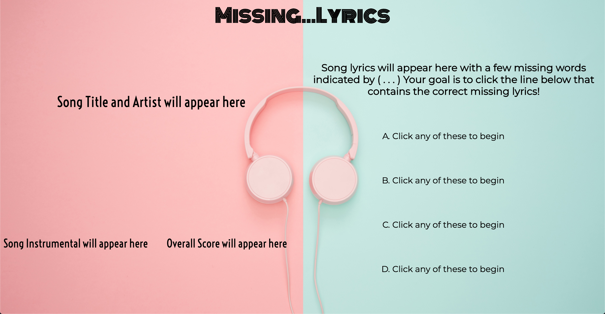

# Missing...Lyrics #
## Game Description ##
#### A game based off the memorization of song lyrics across multiple different genres of music. The player's goal is to select the correct missing lyrics from a multiple-choice style list for a total of ten songs. The game's purpose is for entertainment and to hopefully help the player discover new songs and genres of music. 
## Getting Started 
#### Game Link : 
#### 1) Inspect game layout, such as the location of the song title, artist's name, lyrics, etc.
#### 2) Click the 'Start' button to begin the game
#### 3) Select your answer using the drop-down list and clicking the button beside it to submit your answer and to continue to the next song
#### 4) After answering all ten songs, a total score will appear along with a 'Play Again' button which will restart the game
## Game Screenshot

## Technologies Used
#### - HTML
#### - CSS
#### - Javascript
## Next Steps
#### - add Spotify play button to allow players to listen to snippets of songs
#### - add images of albums of correct answers to final score page
